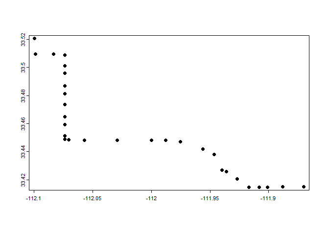
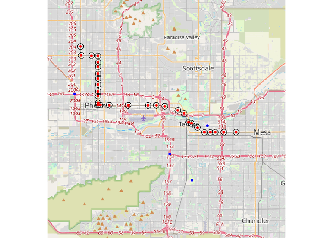
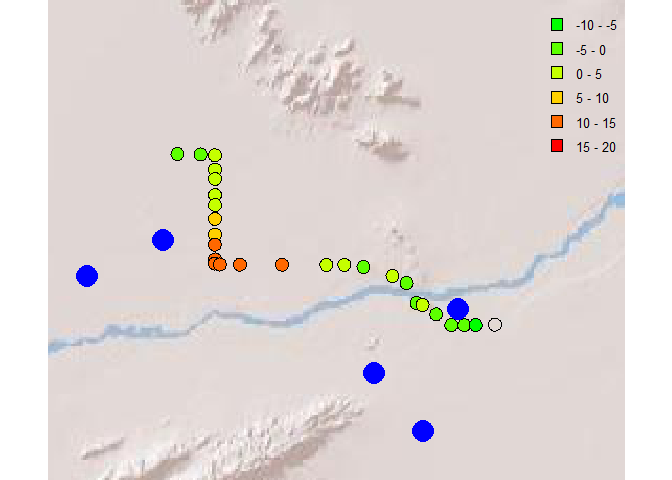
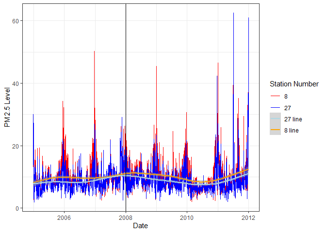

# Progress Report
William & Sebastian

## Research Question

- What is the impact of air pollution caused by light rail stations on
  demographics in Phoenix and Mesa?

## Hypothesis

- The Light Rail in Phoenix-Mesa should help alleviate the amount of
  PM2.5 being released into the air, helping decrease air quality
  diseases around the area. Phoenix-Mesa has seen an increase in
  population, it has had a 16.31% increase in population from 2004 to
  2012, increasing further as the years progressed. this increase in
  population is enough to congest roads and increase the demand for
  power to provide to the citizens. All of this can increase the levels
  of PM2.5. the light rail will help alleviate the by delivering faster,
  community transportation that would decrease the number of cars in the
  streets. With fewer cars in the streets, roads can help decongest
  faster. So Overall, the impact of the light rail on air pollution in
  the Phoenix-Mesa region (Maricopa County) will increase as more people
  use the light rail, further reducing one of their biggest contributors
  of PM2.5 pollution.

## Data

``` r
library("tidyverse") 
library("knitr") 
library("terra") 
library("maptiles")
library("RColorBrewer")
```

- Timeline of interest

  - Given the time frame of the data we have access to from NASA, the
    only stations that existed then all opened on December 27th, 2008.
    We want to track the pollution in an equal timeframe before and
    after the opening, so we chose the timeframe of January 1st, 2004 to
    January 1st, 2012

- Station locations

  - We used a Google API key to collect the coordinates of each of these
    stations, manually collecting the few that Google didn’t
    automatically find.

    ``` r
    c<-read.csv("Coordinates.csv") %>%   
      select(Station, lat2, lon2) 
    kable(c)
    ```

    | Station                                   |     lat2 |      lon2 |
    |:------------------------------------------|---------:|----------:|
    | 19th Ave/Montebello Station,Phoenix       | 33.52060 | -112.0997 |
    | 19th Ave/Camelback Station,Phoenix        | 33.50954 | -112.0988 |
    | 7th Ave/Camelback Station,Phoenix         | 33.50931 | -112.0833 |
    | Central Ave/Camelback Station,Phoenix     | 33.50886 | -112.0739 |
    | Campbell/Central Ave Station,Phoenix      | 33.50095 | -112.0738 |
    | Indian School/Central Ave Station,Phoenix | 33.49575 | -112.0738 |
    | Osborn/Central Ave Station,Phoenix        | 33.48685 | -112.0738 |
    | Thomas/Central Ave Station,Phoenix        | 33.48123 | -112.0738 |
    | Encanto/Central Ave Station,Phoenix       | 33.47365 | -112.0738 |
    | McDowell/Central Ave Station,Phoenix      | 33.46497 | -112.0738 |
    | Roosevelt/Central Ave Station,Phoenix     | 33.45934 | -112.0739 |
    | Van Buren/Central Ave Station,Phoenix     | 33.45114 | -112.0737 |
    | Washington/Central Ave Station,Phoenix    | 33.44889 | -112.0739 |
    | 3rd St/Washington Station,Phoenix         | 33.44835 | -112.0706 |
    | 12th St/Washington Station,Phoenix        | 33.44825 | -112.0573 |
    | 24th St/Washington Station,Phoenix        | 33.44819 | -112.0293 |
    | 38th St/Washington Station,Phoenix        | 33.44810 | -111.9999 |
    | 44th St/Washington Station,Phoenix        | 33.44818 | -111.9879 |
    | 50th St/Washington Station,Phoenix        | 33.44698 | -111.9753 |
    | Priest Dr/Washington Station,Phoenix      | 33.44200 | -111.9560 |
    | Center Pkwy/Washington Station,Phoenix    | 33.43806 | -111.9466 |
    | Mill Ave/3rd St Station,Phoenix           | 33.42700 | -111.9400 |
    | Veteran’s Way/College Station,Phoenix     | 33.42600 | -111.9360 |
    | University Dr/Rural Rd Station,Phoenix    | 33.42073 | -111.9270 |
    | Dorsey/Apache Blvd Station,Phoenix        | 33.41477 | -111.9169 |
    | McClintock/Apache Blvd Station,Phoenix    | 33.41474 | -111.9083 |
    | Smith-Martin/Apache Blvd Station,Phoenix  | 33.41479 | -111.9008 |
    | Price-101 Fwy/Apache Blvd Station,Phoenix | 33.41500 | -111.8880 |
    | Sycamore/Main St Station,Phoenix          | 33.41500 | -111.8700 |

- Factors that impact PM2.5 in the city

  Many factors contribute to the PM2.5 level in the air in Maricopa
  County, this is the Phoenix-Mesa area we are focusing on. According to
  Maricopa’s official website, some of the biggest contributors to PM2.5
  pollution include wood burning, power plants, congested highways,
  construction sites, and unpaved roads. Using the same technique of
  acquiring their coordinates from Google API, we can make a table that
  contains some of the biggest contributors around this county, some
  more centralized in the city than others.

``` r
sources <- read.csv("Poll_Coordinates.csv") %>%     
  filter(Source != "SOURCE Arizona") %>%     
  select(Source,lat2,lon2) 
kable(sources) 
```

| Source                                                |     lat2 |      lon2 |
|:------------------------------------------------------|---------:|----------:|
| Intersection of Interstate 17 & Interstate 10 Arizona | 33.46184 | -112.1083 |
| Intersection of Interstate 10 & U.S. 60 Arizona       | 33.38801 | -111.9676 |
| Palo Verde Nuclear generation Station Arizona         | 33.38800 | -112.8617 |
| Agua Fria Generating Station Arizona                  | 33.55432 | -112.2138 |
| Arlington Valley Plant Arizona                        | 33.34170 | -112.8897 |
| Gila River Generating Station Arizona                 | 32.97500 | -112.6944 |
| Harquahala Generating Station Arizona                 | 33.47573 | -113.1136 |
| Kyrene Power Plant Arizona                            | 33.35560 | -111.9353 |
| Mesquite Power Plant Arizona                          | 33.34500 | -112.8642 |
| Ocotillo Power Plant Arizona                          | 33.42320 | -111.9123 |
| Red Hawk Power Station Arizona                        | 33.33456 | -112.8406 |
| Santan Power Plant Arizona                            | 33.33250 | -111.7503 |
| West Phoenix Power Plant Arizona                      | 33.44170 | -112.1583 |

## Plotting Stations

Once we had the coordinates, we could plot them out and create a map
displaying the stations and the line they all service, as well as a
circular buffer representing the station’s area of effect.

``` r
stations <- read.csv("Coordinates.csv") 
sources <- read.csv("Poll_Coordinates.csv")  
df<-stations |>   select(lon2, lat2)  
df2<-sources |>   select(lon2, lat2)  
#converts df into a spatvector 
x <- vect(df, geom=c("lon2", "lat2"), crs="+proj=longlat +ellps=WGS84 +datum=WGS84 +no_defs ") 
y <- vect(df2, geom=c("lon2", "lat2"), crs="+proj=longlat +ellps=WGS84 +datum=WGS84 +no_defs ") 
#these are the stations  plot(x) #these are our sources of Pollution in Maricopa County 
plot(y) 
```



This would then put buffers over our stations with a 1000m radius. We
get a more complete map by combining a map background, our points, and
their station buffers.

``` r
#create a 1 km (1000 meter) buffer (radius)  
pts_buffer<-buffer(x, width = 400) 
plot(pts_buffer)   
```


``` r
#approximate size of the background 
extent<-buffer(x, width = 400)  
bg <- get_tiles(ext(extent))  
plot(bg)  
#plotting the Stations and their buffers,as well as sources of pollution 
lines(pts_buffer) 
points(x, col = "red") 
points(y, col = "blue") 
```



``` r
outfile <- "buffer.shp" 
writeVector(pts_buffer, outfile, overwrite=TRUE) 
```

## **Gathering Meteorology Data**

To check the effects of pollution from sources around the city, whether
it comes from stations, power plants, and highways or the effects of
policies that might affect these levels of pollution, we need
meteorological data. we will be using data from NASA, through its Land
Data Assimilation System (LDAS) and its global counterpart (GLDAS).
These data can be gathered from NASA’s website. We downloaded all
relevant data into a Google Drive folder, ranging from the dates of
01/01/2000 to 30/12/20214. This already covers our original date range
of 01/01/2000 to 01/01/2012.

The code below opens this data and loops through its files to only get
the relevant dates. Next, it uses the buffer zones around the train
stations to only put the data from these areas. Lastly, it puts it all
into a CSV file.

``` r
files<-dir("G:/Shared drives/2024 FIRE Light Rail/DATA/GLDAS/")

output<-c()

for(i in 1822:4384){
  r<-rast(paste0("G:/Shared drives/2024 FIRE Light Rail/DATA/GLDAS/", files[i]))
  
  sta<-vect("buffer.shp")
  
  #crops raster to contain only buffers around stations
  int<-crop(r, sta,
            snap="in",
            mask=TRUE)
  
  #convert cropped raster into dataframe and fine average value
  metdf<-terra::extract(int, sta, fun="mean", na.rm=TRUE)  %>%
    summarise(across(where(is.numeric), ~ mean(.x, na.rm = TRUE))) %>%
    select(-ID)
  
  metdf$date<-files[i]
  output<-rbind(output, metdf)
  print(files[i])
}
 
write.csv(output, "met_data.csv", row.names=F)
```

## **Gathering PM2.5 Data**

Similarly to Meteorology data, we need to also gather PM2.5 to see the
changes these stations have on this type of pollution. we focus on the
same time frame as meteorology data. Our data comes from NASA. We
downloaded the data into another Google Drive folder. we then use a
nested for-loop to go through each folder (which are months), and go
through each day (they are TIF files containing satellite images of the
US). The buffers we used for the meteorology data are also used again to
focus on those parts of the map. We put all these daily files into a
folder that will be used later on.

``` r
pts_buffer <- vect("buffer.shp")

path<-"G:/Shared drives/2024 FIRE Light Rail/DATA/PM25/"
months<-dir(path)
# for each month
for (m in 1:length(months)) {
  print(months[m])
  days<-dir(paste0(path,months[m]))
  
  # for each day in this month
  days_output<-c()
  for (d in 1:length(days)) {
    print(days[d])
    
    #read tif file
    r<-rast(paste0(path, months[m], "/", days[d]))
    
    #changes the crs system
    buffer_project<-terra::project(pts_buffer,  crs(r))
    
    #pts_buffer is the buffer around stations
    #crops raster to contain only buffers around stations
    int<-crop(r, buffer_project,
              snap="in",
              mask=TRUE)
    
    #convert cropped raster into dataframe and fine average value
    cntrl_df<-terra::extract(int, buffer_project, fun="mean", na.rm=TRUE)
    
    #rename columns
    names(cntrl_df)<-c("city_num","pm25")
    
    #create a dataframe date, shape index, and pm25
    output <- as.data.frame(c("date"=days[d], cntrl_df))
    
    #combine output with previous looop
    days_output<-rbind(days_output, output)
   
    
  }
  write.csv(days_output, 
            paste0("PM25_daily/lr_centroid_",
                   months[m],
                   ".csv")
            , row.names = F)
  
}
```

## **Combining all data gathered**

Now that we have station locations, sources of pollution locations,
meteorology data, and PM2.5 data, we combine all of these into one
single data frame. Holiday dates were added and compared to dates on the
time frame to verify if those dates were holidays. all of the data are
then combined into a data frame using merge() and outputted into a CSV
file.

``` r
setwd("PM25_daily")
file_list <- list.files()

dataset<-data.frame()

for (file in file_list){
    temp_dataset <-read.csv(file)
    dataset<-rbind(dataset, temp_dataset)
    rm(temp_dataset)
}
setwd("..")
stations<-read.csv("Coordinates.csv")
merge1<-merge(dataset,stations, by.x = "city_num", by.y = "X")
newdates <- gsub("(....)(..)(..)(\\.tif)", "\\1-\\2-\\3", merge1$date)
merge1$date <- as.Date(newdates)
holidays <- read.csv("major_holidays_2000_2025.csv")
is_holiday <- newdates %in% holidays$date
merge1$is_holiday <- is_holiday
merge1$dow <- weekdays(merge1$date)
merge1$month <- format(merge1$date, "%m")
dfm<-read.csv("met_data.csv")
newdates2 <- as.Date(gsub("(....)(..)(..)(\\.020\\.nc4)", "\\1-\\2-\\3", dfm$date))
dfm$date <- newdates2
merge2<-merge(merge1, dfm, by.x="date", by.y="date")

write.csv(merge2, "Big_Data.csv")
```

## Modeling and using DB-OLS regression

we now want to create a model that would give us a coefficient that we
can use to tell the relationship between the pollution levels and the
metro stations opening. we will create our dates for the start of the
analysis to the end of it, the opening date of the stations, when
construction began for the stations, and a policy that was enacted
around that same time. df2 has our initial big data that was combined
above, but it removes unnecessary columns that wont be used on the
regression.

``` r
df<-read.csv("Big_Data.csv")
df2<-df %>% mutate(date=as.Date(date, format='%Y-%m-%d'))
df2 <- subset(df2, select = -c(V1, V2, V3, lon, lat, address, X, lat2, lon2, Station))

#period of analysis

startdate<-as.Date("2004-12-01", format='%Y-%m-%d')
enddate<-as.Date("2012-12-01", format='%Y-%m-%d')
opendate<-as.Date("2008-12-27", format='%Y-%m-%d')
conststart<-as.Date("2005-03-01", format='%Y-%m-%d')
poldate<-as.Date("2004-01-21", format='%Y-%m-%d')
```

We now add variables that will be used for the regression. we have a
policy variable that would be a 1 when it is active and 0 when it is
not. Like with Metro open, it just states which dates the metro stations
where open or not. other variables are temperature, wind, humidity and
time variable.

``` r
df3<-df2 %>%
  filter(date>=startdate & date<=enddate) %>%
  mutate(policy=ifelse(date>=poldate, 1, 0)) %>%
  mutate(MetroOpen=ifelse(date>=opendate, 1, 0)) %>%
  mutate(dow=wday(date)) %>%
  mutate(construction=ifelse(date>conststart & date<opendate, 
                             1, 0)) %>%
  #Create P(t) variables
  mutate(t=as.numeric(date-startdate)) %>%
  mutate(t2=t^2, t3=t^3, t4=t^4) %>%
  #Create lagged values (do this for temperature, humidity, and wind speed)
  arrange(city_num, date) %>%
  group_by(city_num) %>%
  mutate(lag_temp=lag(Tair_f_tavg)) %>%
  mutate(lag_temp2=lag_temp^2, lag_temp3=lag_temp^3, lag_temp4=lag_temp^4) %>%
  mutate(lag_wind=lag(Wind_f_tavg)) %>%
  mutate(lag_wind2=lag_wind^2, lag_wind3=lag_wind^3, lag_wind4=lag_wind^4) %>%
  mutate(lag_hum=lag(Qair_f_tavg)) %>%
  mutate(lag_hum2=lag_hum^2, lag_hum3=lag_hum^3, lag_hum4=lag_hum^4) %>%
  mutate(MetroTime=MetroOpen*t, MetroTime2=MetroOpen*t2, MetroTime3=MetroOpen*t3, MetroTime4=MetroOpen*t4)
```

Our first simple regression is just to see the effect on PM2.5 when the
metro is open. this is not a good model as it only considers one
variable. we would need to add more variables to see if any hidden
variables might be affecting the levels of pollution in our areas. so we
begin to add more to the regression to see how the variable “Metro Open”
changes with each regression and added variable.

``` r
#simple regression
summary(m1<-lm(log(pm25) ~ MetroOpen + as.factor(dow) + as.factor(month), data=df3))
```


    Call:
    lm(formula = log(pm25) ~ MetroOpen + as.factor(dow) + as.factor(month), 
        data = df3)

    Residuals:
        Min      1Q  Median      3Q     Max 
    -2.0435 -0.2192  0.0073  0.2271  2.1418 

    Coefficients:
                        Estimate Std. Error t value Pr(>|t|)    
    (Intercept)         2.401302   0.005897 407.188  < 2e-16 ***
    MetroOpen          -0.073246   0.002778 -26.366  < 2e-16 ***
    as.factor(dow)2    -0.002600   0.005143  -0.505 0.613251    
    as.factor(dow)3    -0.009915   0.005143  -1.928 0.053879 .  
    as.factor(dow)4     0.016594   0.005143   3.226 0.001255 ** 
    as.factor(dow)5     0.014670   0.005143   2.852 0.004345 ** 
    as.factor(dow)6     0.052751   0.005143  10.256  < 2e-16 ***
    as.factor(dow)7     0.017099   0.005143   3.325 0.000885 ***
    as.factor(month)2  -0.245479   0.006844 -35.868  < 2e-16 ***
    as.factor(month)3  -0.359717   0.006676 -53.878  < 2e-16 ***
    as.factor(month)4  -0.324935   0.006732 -48.268  < 2e-16 ***
    as.factor(month)5  -0.265823   0.006676 -39.817  < 2e-16 ***
    as.factor(month)6  -0.233232   0.006732 -34.645  < 2e-16 ***
    as.factor(month)7  -0.200728   0.006676 -30.066  < 2e-16 ***
    as.factor(month)8  -0.305255   0.006676 -45.722  < 2e-16 ***
    as.factor(month)9  -0.244434   0.006732 -36.309  < 2e-16 ***
    as.factor(month)10 -0.232710   0.006676 -34.857  < 2e-16 ***
    as.factor(month)11  0.040281   0.006732   5.984 2.19e-09 ***
    as.factor(month)12  0.216976   0.006631  32.720  < 2e-16 ***
    ---
    Signif. codes:  0 '***' 0.001 '**' 0.01 '*' 0.05 '.' 0.1 ' ' 1

    Residual standard error: 0.3618 on 69182 degrees of freedom
      (5126 observations deleted due to missingness)
    Multiple R-squared:  0.1847,    Adjusted R-squared:  0.1845 
    F-statistic:   871 on 18 and 69182 DF,  p-value: < 2.2e-16

``` r
summary(m1<-lm(log(pm25) ~ MetroOpen + as.factor(dow) + as.factor(month) +Tair_f_tavg+lag_temp+lag_temp2 + lag_temp3 + lag_temp4 +Wind_f_tavg+lag_wind+ lag_wind2 + lag_wind3 + lag_wind4+Qair_f_tavg+lag_hum+lag_hum2 + lag_hum3 + lag_hum4+construction, data=df3))
```


    Call:
    lm(formula = log(pm25) ~ MetroOpen + as.factor(dow) + as.factor(month) + 
        Tair_f_tavg + lag_temp + lag_temp2 + lag_temp3 + lag_temp4 + 
        Wind_f_tavg + lag_wind + lag_wind2 + lag_wind3 + lag_wind4 + 
        Qair_f_tavg + lag_hum + lag_hum2 + lag_hum3 + lag_hum4 + 
        construction, data = df3)

    Residuals:
         Min       1Q   Median       3Q      Max 
    -1.95792 -0.20031 -0.00128  0.20499  2.29061 

    Coefficients:
                         Estimate Std. Error t value Pr(>|t|)    
    (Intercept)         2.945e+04  1.759e+03  16.738  < 2e-16 ***
    MetroOpen           1.198e-01  8.900e-03  13.458  < 2e-16 ***
    as.factor(dow)2     7.057e-04  4.734e-03   0.149   0.8815    
    as.factor(dow)3    -1.010e-02  4.736e-03  -2.132   0.0330 *  
    as.factor(dow)4     1.013e-02  4.738e-03   2.138   0.0325 *  
    as.factor(dow)5     4.931e-03  4.732e-03   1.042   0.2974    
    as.factor(dow)6     3.728e-02  4.737e-03   7.869 3.62e-15 ***
    as.factor(dow)7    -1.527e-03  4.730e-03  -0.323   0.7468    
    as.factor(month)2  -2.568e-01  6.427e-03 -39.950  < 2e-16 ***
    as.factor(month)3  -4.410e-01  6.978e-03 -63.201  < 2e-16 ***
    as.factor(month)4  -4.442e-01  8.030e-03 -55.319  < 2e-16 ***
    as.factor(month)5  -4.928e-01  9.378e-03 -52.553  < 2e-16 ***
    as.factor(month)6  -6.244e-01  1.094e-02 -57.089  < 2e-16 ***
    as.factor(month)7  -5.833e-01  1.242e-02 -46.970  < 2e-16 ***
    as.factor(month)8  -6.541e-01  1.200e-02 -54.526  < 2e-16 ***
    as.factor(month)9  -5.495e-01  1.096e-02 -50.121  < 2e-16 ***
    as.factor(month)10 -3.995e-01  8.816e-03 -45.314  < 2e-16 ***
    as.factor(month)11 -1.019e-01  7.177e-03 -14.196  < 2e-16 ***
    as.factor(month)12  1.503e-01  6.214e-03  24.181  < 2e-16 ***
    Tair_f_tavg         2.377e-02  6.245e-04  38.059  < 2e-16 ***
    lag_temp           -3.985e+02  2.395e+01 -16.643  < 2e-16 ***
    lag_temp2           2.022e+00  1.222e-01  16.554  < 2e-16 ***
    lag_temp3          -4.561e-03  2.769e-04 -16.473  < 2e-16 ***
    lag_temp4           3.858e-06  2.353e-07  16.398  < 2e-16 ***
    Wind_f_tavg        -8.265e-02  1.800e-03 -45.922  < 2e-16 ***
    lag_wind           -1.659e+00  1.046e-01 -15.864  < 2e-16 ***
    lag_wind2           6.970e-01  4.397e-02  15.850  < 2e-16 ***
    lag_wind3          -1.252e-01  7.858e-03 -15.933  < 2e-16 ***
    lag_wind4           7.984e-03  5.044e-04  15.830  < 2e-16 ***
    Qair_f_tavg        -3.490e+01  9.492e-01 -36.762  < 2e-16 ***
    lag_hum            -3.123e+01  1.756e+01  -1.779   0.0753 .  
    lag_hum2           -1.065e+03  3.717e+03  -0.287   0.7744    
    lag_hum3            3.788e+05  3.219e+05   1.177   0.2392    
    lag_hum4           -1.604e+07  9.720e+06  -1.651   0.0988 .  
    construction        1.984e-01  8.915e-03  22.255  < 2e-16 ***
    ---
    Signif. codes:  0 '***' 0.001 '**' 0.01 '*' 0.05 '.' 0.1 ' ' 1

    Residual standard error: 0.3317 on 69139 degrees of freedom
      (5153 observations deleted due to missingness)
    Multiple R-squared:  0.3125,    Adjusted R-squared:  0.3121 
    F-statistic: 924.2 on 34 and 69139 DF,  p-value: < 2.2e-16

``` r
summary(m1<-lm(log(pm25) ~ MetroOpen +Tair_f_tavg+lag_temp+lag_temp2 + lag_temp3 + lag_temp4 +Wind_f_tavg+lag_wind+ lag_wind2 + lag_wind3 + lag_wind4+Qair_f_tavg+lag_hum+lag_hum2 + lag_hum3 + lag_hum4+construction+is_holiday+t+t2+t3+t4 , data=df3))
```


    Call:
    lm(formula = log(pm25) ~ MetroOpen + Tair_f_tavg + lag_temp + 
        lag_temp2 + lag_temp3 + lag_temp4 + Wind_f_tavg + lag_wind + 
        lag_wind2 + lag_wind3 + lag_wind4 + Qair_f_tavg + lag_hum + 
        lag_hum2 + lag_hum3 + lag_hum4 + construction + is_holiday + 
        t + t2 + t3 + t4, data = df3)

    Residuals:
         Min       1Q   Median       3Q      Max 
    -1.76216 -0.21149 -0.00632  0.20611  2.34219 

    Coefficients:
                     Estimate Std. Error t value Pr(>|t|)    
    (Intercept)     1.455e+04  1.671e+03   8.709  < 2e-16 ***
    MetroOpen       3.142e-02  1.373e-02   2.288 0.022148 *  
    Tair_f_tavg     8.593e-03  6.186e-04  13.891  < 2e-16 ***
    lag_temp       -1.987e+02  2.273e+01  -8.746  < 2e-16 ***
    lag_temp2       1.019e+00  1.159e-01   8.795  < 2e-16 ***
    lag_temp3      -2.324e-03  2.625e-04  -8.855  < 2e-16 ***
    lag_temp4       1.990e-06  2.229e-07   8.925  < 2e-16 ***
    Wind_f_tavg    -9.429e-02  1.866e-03 -50.534  < 2e-16 ***
    lag_wind       -1.378e+00  1.096e-01 -12.576  < 2e-16 ***
    lag_wind2       5.348e-01  4.605e-02  11.614  < 2e-16 ***
    lag_wind3      -8.978e-02  8.223e-03 -10.918  < 2e-16 ***
    lag_wind4       5.333e-03  5.275e-04  10.110  < 2e-16 ***
    Qair_f_tavg    -3.672e+01  9.836e-01 -37.331  < 2e-16 ***
    lag_hum        -1.762e+02  1.831e+01  -9.622  < 2e-16 ***
    lag_hum2        2.271e+04  3.872e+03   5.866 4.49e-09 ***
    lag_hum3       -1.291e+06  3.350e+05  -3.852 0.000117 ***
    lag_hum4        2.579e+07  1.011e+07   2.550 0.010769 *  
    construction    1.898e-01  1.184e-02  16.032  < 2e-16 ***
    is_holidayTRUE  2.230e-01  7.484e-03  29.793  < 2e-16 ***
    t              -1.199e-03  4.880e-05 -24.562  < 2e-16 ***
    t2              2.297e-06  7.113e-08  32.291  < 2e-16 ***
    t3             -1.380e-09  4.029e-11 -34.262  < 2e-16 ***
    t4              2.632e-13  7.686e-15  34.240  < 2e-16 ***
    ---
    Signif. codes:  0 '***' 0.001 '**' 0.01 '*' 0.05 '.' 0.1 ' ' 1

    Residual standard error: 0.3483 on 69151 degrees of freedom
      (5153 observations deleted due to missingness)
    Multiple R-squared:  0.2422,    Adjusted R-squared:  0.2419 
    F-statistic:  1004 on 22 and 69151 DF,  p-value: < 2.2e-16

``` r
summary(m1<-lm(log(pm25) ~ MetroOpen:as.factor(city_num)+Tair_f_tavg+lag_temp+lag_temp2 + lag_temp3 + lag_temp4 +Wind_f_tavg+lag_wind+ lag_wind2 + lag_wind3 + lag_wind4+Qair_f_tavg+lag_hum+lag_hum2 + lag_hum3 + lag_hum4+construction+is_holiday+t+t2+t3+t4 , data=df3))
```


    Call:
    lm(formula = log(pm25) ~ MetroOpen:as.factor(city_num) + Tair_f_tavg + 
        lag_temp + lag_temp2 + lag_temp3 + lag_temp4 + Wind_f_tavg + 
        lag_wind + lag_wind2 + lag_wind3 + lag_wind4 + Qair_f_tavg + 
        lag_hum + lag_hum2 + lag_hum3 + lag_hum4 + construction + 
        is_holiday + t + t2 + t3 + t4, data = df3)

    Residuals:
         Min       1Q   Median       3Q      Max 
    -1.76216 -0.21129 -0.00628  0.20426  2.50606 

    Coefficients:
                                      Estimate Std. Error t value Pr(>|t|)    
    (Intercept)                      1.455e+04  1.659e+03   8.770  < 2e-16 ***
    Tair_f_tavg                      8.593e-03  6.142e-04  13.989  < 2e-16 ***
    lag_temp                        -1.987e+02  2.257e+01  -8.807  < 2e-16 ***
    lag_temp2                        1.019e+00  1.151e-01   8.856  < 2e-16 ***
    lag_temp3                       -2.324e-03  2.607e-04  -8.917  < 2e-16 ***
    lag_temp4                        1.990e-06  2.214e-07   8.987  < 2e-16 ***
    Wind_f_tavg                     -9.429e-02  1.853e-03 -50.889  < 2e-16 ***
    lag_wind                        -1.378e+00  1.088e-01 -12.664  < 2e-16 ***
    lag_wind2                        5.348e-01  4.573e-02  11.696  < 2e-16 ***
    lag_wind3                       -8.978e-02  8.166e-03 -10.995  < 2e-16 ***
    lag_wind4                        5.333e-03  5.238e-04  10.181  < 2e-16 ***
    Qair_f_tavg                     -3.672e+01  9.767e-01 -37.593  < 2e-16 ***
    lag_hum                         -1.762e+02  1.818e+01  -9.689  < 2e-16 ***
    lag_hum2                         2.271e+04  3.845e+03   5.907 3.50e-09 ***
    lag_hum3                        -1.291e+06  3.327e+05  -3.879 0.000105 ***
    lag_hum4                         2.579e+07  1.004e+07   2.568 0.010229 *  
    construction                     1.898e-01  1.176e-02  16.144  < 2e-16 ***
    is_holidayTRUE                   2.230e-01  7.432e-03  30.002  < 2e-16 ***
    t                               -1.199e-03  4.846e-05 -24.734  < 2e-16 ***
    t2                               2.297e-06  7.064e-08  32.518  < 2e-16 ***
    t3                              -1.380e-09  4.001e-11 -34.503  < 2e-16 ***
    t4                               2.632e-13  7.632e-15  34.481  < 2e-16 ***
    MetroOpen:as.factor(city_num)2  -2.118e-02  1.705e-02  -1.243 0.214001    
    MetroOpen:as.factor(city_num)3  -2.284e-05  1.705e-02  -0.001 0.998931    
    MetroOpen:as.factor(city_num)4   7.876e-03  1.705e-02   0.462 0.644073    
    MetroOpen:as.factor(city_num)5   2.088e-02  1.705e-02   1.225 0.220659    
    MetroOpen:as.factor(city_num)6   1.852e-02  1.705e-02   1.087 0.277234    
    MetroOpen:as.factor(city_num)7   4.955e-02  1.705e-02   2.906 0.003659 ** 
    MetroOpen:as.factor(city_num)8   4.325e-02  1.705e-02   2.537 0.011193 *  
    MetroOpen:as.factor(city_num)9   6.548e-02  1.705e-02   3.841 0.000123 ***
    MetroOpen:as.factor(city_num)10  9.925e-02  1.705e-02   5.822 5.85e-09 ***
    MetroOpen:as.factor(city_num)11  1.442e-01  1.705e-02   8.457  < 2e-16 ***
    MetroOpen:as.factor(city_num)12  1.041e-01  1.705e-02   6.105 1.03e-09 ***
    MetroOpen:as.factor(city_num)13  1.041e-01  1.705e-02   6.105 1.03e-09 ***
    MetroOpen:as.factor(city_num)14  1.384e-01  1.705e-02   8.117 4.87e-16 ***
    MetroOpen:as.factor(city_num)15  1.262e-01  1.705e-02   7.405 1.33e-13 ***
    MetroOpen:as.factor(city_num)16  1.023e-01  1.705e-02   6.002 1.96e-09 ***
    MetroOpen:as.factor(city_num)17  4.220e-02  1.705e-02   2.475 0.013318 *  
    MetroOpen:as.factor(city_num)18  2.214e-02  1.705e-02   1.299 0.194080    
    MetroOpen:as.factor(city_num)19 -2.072e-03  1.705e-02  -0.122 0.903254    
    MetroOpen:as.factor(city_num)20  2.559e-02  1.705e-02   1.501 0.133368    
    MetroOpen:as.factor(city_num)21 -1.280e-02  1.705e-02  -0.751 0.452741    
    MetroOpen:as.factor(city_num)22 -3.635e-03  1.705e-02  -0.213 0.831135    
    MetroOpen:as.factor(city_num)23  1.769e-02  1.705e-02   1.038 0.299378    
    MetroOpen:as.factor(city_num)24 -7.734e-03  1.705e-02  -0.454 0.650062    
    MetroOpen:as.factor(city_num)25 -5.436e-03  1.705e-02  -0.319 0.749812    
    MetroOpen:as.factor(city_num)26 -1.993e-02  1.705e-02  -1.169 0.242433    
    MetroOpen:as.factor(city_num)27 -7.798e-02  1.705e-02  -4.574 4.80e-06 ***
    MetroOpen:as.factor(city_num)28 -1.324e-01  1.705e-02  -7.769 8.03e-15 ***
    ---
    Signif. codes:  0 '***' 0.001 '**' 0.01 '*' 0.05 '.' 0.1 ' ' 1

    Residual standard error: 0.3458 on 69125 degrees of freedom
      (5153 observations deleted due to missingness)
    Multiple R-squared:  0.253, Adjusted R-squared:  0.2525 
    F-statistic: 487.7 on 48 and 69125 DF,  p-value: < 2.2e-16

## Creating a Map and Drawing Conclusions

From the regression we thought was best, we turned the map of the
stations into a representation of which locations saw the largest
increases/decreases, as well as showing the other nearby pollution
sources.

``` r
summary(m1<-lm(log(pm25) ~ MetroOpen:as.factor(city_num)+Tair_f_tavg+lag_temp+lag_temp2 + lag_temp3 + lag_temp4 +Wind_f_tavg+lag_wind+ lag_wind2 + lag_wind3 + lag_wind4+Qair_f_tavg+lag_hum+lag_hum2 + lag_hum3 + lag_hum4+construction+is_holiday+t+t2+t3+t4 , data=df3))
```


    Call:
    lm(formula = log(pm25) ~ MetroOpen:as.factor(city_num) + Tair_f_tavg + 
        lag_temp + lag_temp2 + lag_temp3 + lag_temp4 + Wind_f_tavg + 
        lag_wind + lag_wind2 + lag_wind3 + lag_wind4 + Qair_f_tavg + 
        lag_hum + lag_hum2 + lag_hum3 + lag_hum4 + construction + 
        is_holiday + t + t2 + t3 + t4, data = df3)

    Residuals:
         Min       1Q   Median       3Q      Max 
    -1.76216 -0.21129 -0.00628  0.20426  2.50606 

    Coefficients:
                                      Estimate Std. Error t value Pr(>|t|)    
    (Intercept)                      1.455e+04  1.659e+03   8.770  < 2e-16 ***
    Tair_f_tavg                      8.593e-03  6.142e-04  13.989  < 2e-16 ***
    lag_temp                        -1.987e+02  2.257e+01  -8.807  < 2e-16 ***
    lag_temp2                        1.019e+00  1.151e-01   8.856  < 2e-16 ***
    lag_temp3                       -2.324e-03  2.607e-04  -8.917  < 2e-16 ***
    lag_temp4                        1.990e-06  2.214e-07   8.987  < 2e-16 ***
    Wind_f_tavg                     -9.429e-02  1.853e-03 -50.889  < 2e-16 ***
    lag_wind                        -1.378e+00  1.088e-01 -12.664  < 2e-16 ***
    lag_wind2                        5.348e-01  4.573e-02  11.696  < 2e-16 ***
    lag_wind3                       -8.978e-02  8.166e-03 -10.995  < 2e-16 ***
    lag_wind4                        5.333e-03  5.238e-04  10.181  < 2e-16 ***
    Qair_f_tavg                     -3.672e+01  9.767e-01 -37.593  < 2e-16 ***
    lag_hum                         -1.762e+02  1.818e+01  -9.689  < 2e-16 ***
    lag_hum2                         2.271e+04  3.845e+03   5.907 3.50e-09 ***
    lag_hum3                        -1.291e+06  3.327e+05  -3.879 0.000105 ***
    lag_hum4                         2.579e+07  1.004e+07   2.568 0.010229 *  
    construction                     1.898e-01  1.176e-02  16.144  < 2e-16 ***
    is_holidayTRUE                   2.230e-01  7.432e-03  30.002  < 2e-16 ***
    t                               -1.199e-03  4.846e-05 -24.734  < 2e-16 ***
    t2                               2.297e-06  7.064e-08  32.518  < 2e-16 ***
    t3                              -1.380e-09  4.001e-11 -34.503  < 2e-16 ***
    t4                               2.632e-13  7.632e-15  34.481  < 2e-16 ***
    MetroOpen:as.factor(city_num)2  -2.118e-02  1.705e-02  -1.243 0.214001    
    MetroOpen:as.factor(city_num)3  -2.284e-05  1.705e-02  -0.001 0.998931    
    MetroOpen:as.factor(city_num)4   7.876e-03  1.705e-02   0.462 0.644073    
    MetroOpen:as.factor(city_num)5   2.088e-02  1.705e-02   1.225 0.220659    
    MetroOpen:as.factor(city_num)6   1.852e-02  1.705e-02   1.087 0.277234    
    MetroOpen:as.factor(city_num)7   4.955e-02  1.705e-02   2.906 0.003659 ** 
    MetroOpen:as.factor(city_num)8   4.325e-02  1.705e-02   2.537 0.011193 *  
    MetroOpen:as.factor(city_num)9   6.548e-02  1.705e-02   3.841 0.000123 ***
    MetroOpen:as.factor(city_num)10  9.925e-02  1.705e-02   5.822 5.85e-09 ***
    MetroOpen:as.factor(city_num)11  1.442e-01  1.705e-02   8.457  < 2e-16 ***
    MetroOpen:as.factor(city_num)12  1.041e-01  1.705e-02   6.105 1.03e-09 ***
    MetroOpen:as.factor(city_num)13  1.041e-01  1.705e-02   6.105 1.03e-09 ***
    MetroOpen:as.factor(city_num)14  1.384e-01  1.705e-02   8.117 4.87e-16 ***
    MetroOpen:as.factor(city_num)15  1.262e-01  1.705e-02   7.405 1.33e-13 ***
    MetroOpen:as.factor(city_num)16  1.023e-01  1.705e-02   6.002 1.96e-09 ***
    MetroOpen:as.factor(city_num)17  4.220e-02  1.705e-02   2.475 0.013318 *  
    MetroOpen:as.factor(city_num)18  2.214e-02  1.705e-02   1.299 0.194080    
    MetroOpen:as.factor(city_num)19 -2.072e-03  1.705e-02  -0.122 0.903254    
    MetroOpen:as.factor(city_num)20  2.559e-02  1.705e-02   1.501 0.133368    
    MetroOpen:as.factor(city_num)21 -1.280e-02  1.705e-02  -0.751 0.452741    
    MetroOpen:as.factor(city_num)22 -3.635e-03  1.705e-02  -0.213 0.831135    
    MetroOpen:as.factor(city_num)23  1.769e-02  1.705e-02   1.038 0.299378    
    MetroOpen:as.factor(city_num)24 -7.734e-03  1.705e-02  -0.454 0.650062    
    MetroOpen:as.factor(city_num)25 -5.436e-03  1.705e-02  -0.319 0.749812    
    MetroOpen:as.factor(city_num)26 -1.993e-02  1.705e-02  -1.169 0.242433    
    MetroOpen:as.factor(city_num)27 -7.798e-02  1.705e-02  -4.574 4.80e-06 ***
    MetroOpen:as.factor(city_num)28 -1.324e-01  1.705e-02  -7.769 8.03e-15 ***
    ---
    Signif. codes:  0 '***' 0.001 '**' 0.01 '*' 0.05 '.' 0.1 ' ' 1

    Residual standard error: 0.3458 on 69125 degrees of freedom
      (5153 observations deleted due to missingness)
    Multiple R-squared:  0.253, Adjusted R-squared:  0.2525 
    F-statistic: 487.7 on 48 and 69125 DF,  p-value: < 2.2e-16

``` r
len_coef<-length(coef(m1))

#get coefficients of the station-level effect
coef<-coef(m1)[(len_coef-26): len_coef]

#get p values of the station-level effect (p<0.05 is statistically significant)
pval<-summary(m1)$coefficients[,4][(len_coef-26): len_coef]

kable(cbind(coef, pval), digits=2)
```

|                                 |  coef | pval |
|:--------------------------------|------:|-----:|
| MetroOpen:as.factor(city_num)2  | -0.02 | 0.21 |
| MetroOpen:as.factor(city_num)3  |  0.00 | 1.00 |
| MetroOpen:as.factor(city_num)4  |  0.01 | 0.64 |
| MetroOpen:as.factor(city_num)5  |  0.02 | 0.22 |
| MetroOpen:as.factor(city_num)6  |  0.02 | 0.28 |
| MetroOpen:as.factor(city_num)7  |  0.05 | 0.00 |
| MetroOpen:as.factor(city_num)8  |  0.04 | 0.01 |
| MetroOpen:as.factor(city_num)9  |  0.07 | 0.00 |
| MetroOpen:as.factor(city_num)10 |  0.10 | 0.00 |
| MetroOpen:as.factor(city_num)11 |  0.14 | 0.00 |
| MetroOpen:as.factor(city_num)12 |  0.10 | 0.00 |
| MetroOpen:as.factor(city_num)13 |  0.10 | 0.00 |
| MetroOpen:as.factor(city_num)14 |  0.14 | 0.00 |
| MetroOpen:as.factor(city_num)15 |  0.13 | 0.00 |
| MetroOpen:as.factor(city_num)16 |  0.10 | 0.00 |
| MetroOpen:as.factor(city_num)17 |  0.04 | 0.01 |
| MetroOpen:as.factor(city_num)18 |  0.02 | 0.19 |
| MetroOpen:as.factor(city_num)19 |  0.00 | 0.90 |
| MetroOpen:as.factor(city_num)20 |  0.03 | 0.13 |
| MetroOpen:as.factor(city_num)21 | -0.01 | 0.45 |
| MetroOpen:as.factor(city_num)22 |  0.00 | 0.83 |
| MetroOpen:as.factor(city_num)23 |  0.02 | 0.30 |
| MetroOpen:as.factor(city_num)24 | -0.01 | 0.65 |
| MetroOpen:as.factor(city_num)25 | -0.01 | 0.75 |
| MetroOpen:as.factor(city_num)26 | -0.02 | 0.24 |
| MetroOpen:as.factor(city_num)27 | -0.08 | 0.00 |
| MetroOpen:as.factor(city_num)28 | -0.13 | 0.00 |

``` r
c1<-vect("buffer.shp")

c2<-subset(c1, c1$FID>0 & c1$FID<28)
c1df<-as.data.frame(c1)

coef2<-c(coef)*100
coefdf<-as.data.frame(coef2)
cities_coef<-cbind(c2, coefdf)

sources <- read.csv("Poll_Coordinates.csv")
dfy<- sources %>%
  filter(Source != "SOURCE Arizona") %>%
  select(lon2,lat2)
y <- vect(dfy, geom=c("lon2", "lat2"), crs="+proj=longlat +ellps=WGS84 +datum=WGS84 +no_defs ")

bgext<-buffer(c2, width=9000)

#get background map
bg <- get_tiles(ext(bgext),provider = "Esri.WorldShadedRelief", crop = TRUE)

plot(bg)

plot(cities_coef,
     "coef2",
     type="interval",
     breaks=c(-10, -5, 0, 5, 10, 15, 20),
     col=map.pal("gyr"),add=TRUE, legend="topright", plg=list(cex=1))

points(y, col = "blue", cex=3)
```



## Comparing Stations via Line Graph

To show the difference in pollution levels between a station in central
Phoenix (station 8 in the following plot) and a station in Mesa (station
27 in the plot), we made a line graph showing the levels in each station
and added a line of best fit to show that the Phoenix station saw
consistently more pollution. The vertical black line marks the opening
date of the light rail stations.

``` r
df2<-df %>% filter(city_num==8 | city_num==27) %>% mutate(date = as.Date(date)) %>% 
  mutate(city_num2 = as.character(paste0(city_num, " line")))

pal<-c("red","blue","lightblue","orange")

ggplot(df2, aes(x=date, y=pm25, group=city_num)) + 
  geom_line(aes(color=as.factor(city_num))) +
  geom_smooth(aes(color=as.factor(city_num2))) +
  geom_vline(xintercept=as.numeric(as.Date("2008-01-01"))) +
  scale_color_manual(values=pal) + theme_bw() + labs(color = "Station Number") +
  xlab("Date") + ylab("PM2.5 Level")
```

    `geom_smooth()` using method = 'gam' and formula = 'y ~ s(x, bs = "cs")'



## Conclusions

As shown, the stations in the middle of the line near the center of
Phoenix saw an increase in air pollution, while stations closer to the
ends of the line saw decreases. After a little more research, we
discovered that this was likely due to the surrounding geography. The
mountains around Phoenix meant that air pollution in the area would get
trapped in the “bowl” that the mountains created, which would make the
air quality worse over time. The stations near the ends of the line are
not as affected by this phenomenon, and we can see that the light rails
did have an effect decreasing the air pollution in those areas.
