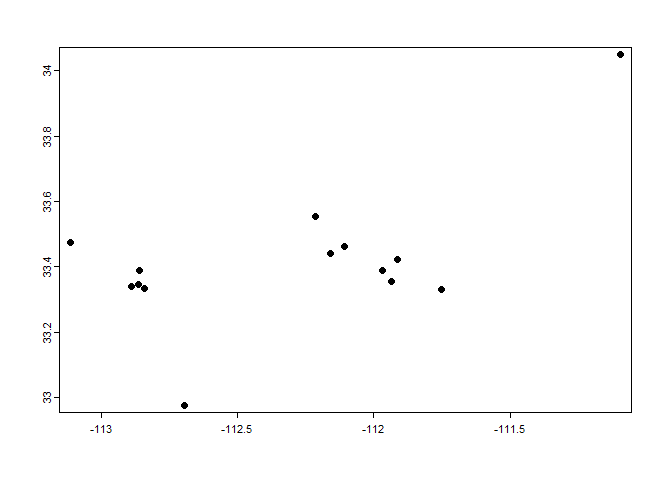

# Progress Report
William & Sebastian

## Research Question

- What is the impact of air pollution caused by light rail stations on
  demographics in Phoenix and Mesa?

## Hypothesis

- There will be significantly more impact on the surrounding area when
  multiple stations are extremely close to each other, as the effects of
  the stations will be compounded by multiple of them being in the same
  place.

## Data

``` r
library("tidyverse")
```

    ── Attaching core tidyverse packages ──────────────────────── tidyverse 2.0.0 ──
    ✔ dplyr     1.1.4     ✔ readr     2.1.5
    ✔ forcats   1.0.0     ✔ stringr   1.5.1
    ✔ ggplot2   3.5.1     ✔ tibble    3.2.1
    ✔ lubridate 1.9.3     ✔ tidyr     1.3.1
    ✔ purrr     1.0.2     
    ── Conflicts ────────────────────────────────────────── tidyverse_conflicts() ──
    ✖ dplyr::filter() masks stats::filter()
    ✖ dplyr::lag()    masks stats::lag()
    ℹ Use the conflicted package (<http://conflicted.r-lib.org/>) to force all conflicts to become errors

``` r
library("knitr")
library("terra")
```

    terra 1.7.78

    Attaching package: 'terra'

    The following object is masked from 'package:knitr':

        spin

    The following object is masked from 'package:tidyr':

        extract

``` r
library("maptiles")
```

- Timeline of interest

  - Given the time frame of the data we have access to from NASA, the
    only stations that existed then all opened in December 27th 2008. We
    want to track the pollution in an equal timeframe before and after
    the opening, so we chose the timeframe of January 1st 2004 to
    January 1st 2012

- Station locations

  - We used a Google API key in order to collect the coordinates of each
    of these stations, manually collecting the few that Google didn’t
    automatically find.

    ``` r
    c<-read.csv("Coordinates.csv") %>%
      select(Station, lat2, lon2)
    kable(c)
    ```

    | Station                                   |     lat2 |      lon2 |
    |:------------------------------------------|---------:|----------:|
    | 19th Ave/Montebello Station,Phoenix       | 33.52060 | -112.0997 |
    | 19th Ave/Camelback Station,Phoenix        | 33.50954 | -112.0988 |
    | 7th Ave/Camelback Station,Phoenix         | 33.50931 | -112.0833 |
    | Central Ave/Camelback Station,Phoenix     | 33.50886 | -112.0739 |
    | Campbell/Central Ave Station,Phoenix      | 33.50095 | -112.0738 |
    | Indian School/Central Ave Station,Phoenix | 33.49575 | -112.0738 |
    | Osborn/Central Ave Station,Phoenix        | 33.48685 | -112.0738 |
    | Thomas/Central Ave Station,Phoenix        | 33.48123 | -112.0738 |
    | Encanto/Central Ave Station,Phoenix       | 33.47365 | -112.0738 |
    | McDowell/Central Ave Station,Phoenix      | 33.46497 | -112.0738 |
    | Roosevelt/Central Ave Station,Phoenix     | 33.45934 | -112.0739 |
    | Van Buren/Central Ave Station,Phoenix     | 33.45114 | -112.0737 |
    | Washington/Central Ave Station,Phoenix    | 33.44889 | -112.0739 |
    | 3rd St/Washington Station,Phoenix         | 33.44835 | -112.0706 |
    | 12th St/Washington Station,Phoenix        | 33.44825 | -112.0573 |
    | 24th St/Washington Station,Phoenix        | 33.44819 | -112.0293 |
    | 38th St/Washington Station,Phoenix        | 33.44810 | -111.9999 |
    | 44th St/Washington Station,Phoenix        | 33.44818 | -111.9879 |
    | 50th St/Washington Station,Phoenix        | 33.44698 | -111.9753 |
    | Priest Dr/Washington Station,Phoenix      | 33.44200 | -111.9560 |
    | Center Pkwy/Washington Station,Phoenix    | 33.43806 | -111.9466 |
    | Mill Ave/3rd St Station,Phoenix           | 33.42700 | -111.9400 |
    | Veteran’s Way/College Station,Phoenix     | 33.42600 | -111.9360 |
    | University Dr/Rural Rd Station,Phoenix    | 33.42073 | -111.9270 |
    | Dorsey/Apache Blvd Station,Phoenix        | 33.41477 | -111.9169 |
    | McClintock/Apache Blvd Station,Phoenix    | 33.41474 | -111.9083 |
    | Smith-Martin/Apache Blvd Station,Phoenix  | 33.41479 | -111.9008 |
    | Price-101 Fwy/Apache Blvd Station,Phoenix | 33.41500 | -111.8880 |
    | Sycamore/Main St Station,Phoenix          | 33.41500 | -111.8700 |

- Factors that impact PM2.5 in the city (Sebastian)

## Plotting Stations

Once we had the coordinates, we could plot them out and create a map
displaying the stations and the line they all service, as well as a
circular buffer representing the station’s area of effect.

``` r
stations <- read.csv("Coordinates.csv")
sources <- read.csv("Poll_Coordinates.csv")

df<-stations |>
  select(lon2, lat2)

df2<-sources |>
  select(lon2, lat2)

#converts df into a spatvector
x <- vect(df, geom=c("lon2", "lat2"), crs="+proj=longlat +ellps=WGS84 +datum=WGS84 +no_defs ")
y <- vect(df2, geom=c("lon2", "lat2"), crs="+proj=longlat +ellps=WGS84 +datum=WGS84 +no_defs ")

plot(x)
```


``` r
plot(y)
```


